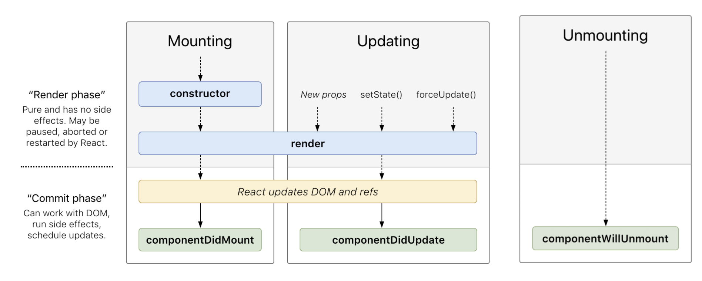
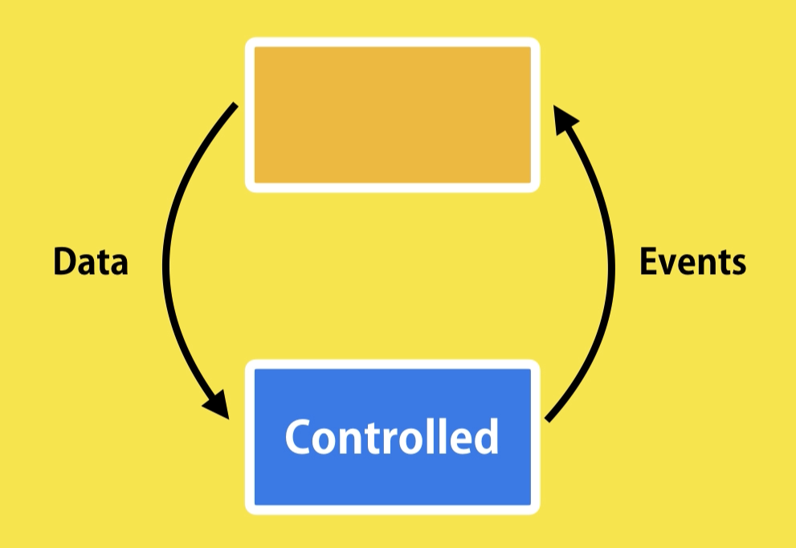

# Learning React.js

> This document provides some key concepts of React with brief explanation and simple examples. The code for each of these examples is also available under the 0-learning-react directory of this repo. Most of the examples used in the initial sections of this repo is built using plain html. In the later part, we will explore how to build production grade single page application using React. At the end of this document there is a list of projects which are also part of this repo.

<br/>

## 1. Getting Started

- In the below example a simple hello-react app is built using React. We can get started with a simple .html file. A few `<script>` tags are added in the `<head>` section to import the necessary packages to run the React app -
  - React library to run the app as a React app
  - React-dom library to update and manage the DOM
  - Babel is used here to transpile the React code to plain JS code
- The react code is written inside another `<script>` tag inside `<body>`

  ```
    <!DOCTYPE html>
    <html>
        <head>
            <meta charset="utf-8" />
            <title>React - Getting Started</title>
            <script src="https://unpkg.com/react@16/umd/react.development.js"></script>
            <script src="https://unpkg.com/react-dom@16/umd/react-dom.development.js"></script>
            <script src="https://unpkg.com/babel-standalone@6.26.0/babel.js"></script>
        </head>
        <body>
            <script type="text/babel">
                ReactDOM.render(<h1>Hello React !</h1>, document.body);
            </script>
        </body>
    </html>
  ```

- Inside the `ReactDOM.render()` method we need to specify 2 things - the first parameter is the **_WHAT_**, i.e., what React element needs to be rendered and the second parameter is the **_WHERE_**, where in the browser DOM the React element needs to be rendered.
- React maintains this virtual DOM that compares the browser DOM and the Virtual DOM and renders only the items that are changed in the DOM.

<br/>

## 2. Components

### 2.A. Building the first `Component`

- **Component** : React `Component`s are basically JavaScript classes that takes in inputs, i.e. properties (props) and returns a React element, that defines how a particular section in the UI will look like. In the below example we see how a `Component` is built -

  ```
    ...
    <body>
        <script type="text/babel">
            class HelloWorld extends React.Component {
                render() {
                    return <h1>Hello React </h1>;
                }
            }
            ReactDOM.render(<HelloWorld />, document.body);
        </script>
    </body>
    ...
  ```

### 2.B. Passing `props` to a `Component`

- One thing React does is that it reduces the redundancy of rendering similarly styled elements by abstracting the same type of elements in Components.
- Different values can be passed to the same `Component` using Properties (`props`) to render the same component differently.
- Using the `this.props.propertyName`, the React `Component` can accept `props` as a JSX expression enclosed in `{}`. React evaluates the expression inside `{}` as JavaScript code and anything outside it as XML. Hence the name **JSX** (JavaScript + XML). We will be re-visiting JSX in details shortly.
- The `render()` method in React Component outputs the JSX. Let's take a look at an example -

  ```
    ...
    <body>
        <script type="text/babel">
            class HelloWorld extends React.Component {
                render() {
                    return <h1>Hello {this.props.greet} !</h1>;
                }
            }
            ReactDOM.render(
                <div>
                <HelloWorld greet="Batman"/>
                <HelloWorld greet="Superman"/>
                <HelloWorld greet="Ironman"/>
                </div>,
            document.body);
        </script>
    </body>
    ...
  ```

### 2.C. Passing `children` to a `Component`

- A React Component can accept any data or element passed via children using `this.props.children`.
- Any data or element passed between the opening <> and closing </> tags of a Component is referred to as `children` of that Component.

  ```
    ...
    <body>
        <script type="text/babel">
            ...
            class MyButton extends React.Component {
            render() {
                return (
                    <div>
                        <button type={this.props.behavior}>{this.props.children}</button>
                    </div>
                );
            }
            }
            ReactDOM.render(
            <div>
                ...
                <MyButton behavior="submit">Welcome Super Heroes !</MyButton>
            </div>,
            document.body
            );
        </script>
    </body>
    ...
  ```

<br/>

## 3. Basic Styling

- Basic styling in React apps can be done by defining styles under the `<style>` tag.
- Styling can also be done by specifying the `style` property inside a JSX element. Properties can be specified in a JavaScript style variable and the same can be passed as a JSX expression in the `style` property. The JS style variable can also refer to `this.props`

  ```
    ...
    <head>
        ...
        <style>
            #container {
                padding: 50px;
                font-family: sans-serif;
                background-color: #ffffff;
                text-align: center;
            }
        </style>
    </head>
    ...
    <body>
        <div id="container">
            <script type="text/babel">
            class Letter extends React.Component {
                render() {
                    const letterStyle = {
                        padding: 10,
                        margin: 10,
                        backgroundColor: this.props.bgColor,
                        ...
                    };
                    return <div style={letterStyle}>{this.props.children}</div>;
                }
            }
            ReactDOM.render(
                <div>
                <Letter bgColor="#58b3ff">A</Letter>
                <Letter bgColor="#ff605f">E</Letter>
                ...
                </div>,
                document.querySelector("#container")
            );
            </script>
        </div>
    </body>
    ...
  ```

<br/>

## 4. Composing Components

- We can build Components in React that uses multiple other Components.
- The general rule is that our components should do just one thing.

  ```
    ...
    class Square extends React.Component {
        render() {
            var squareStyle = {
                ...
            };
            return (
                <div style={squareStyle}>
                <br />
                </div>
            );
        }
    }
    class Label extends React.Component {
        render() {
            var labelStyle = {
                ...
            };
            return (
                <div>
                <p style={labelStyle}>{this.props.color}</p>
                </div>
            );
        }
    }
    class Card extends React.Component {
        render() {
            var cardStyle = {
                ...
            };
            return (
                <div style={cardStyle}>
                <Square color={this.props.color} />
                <Label color={this.props.color} />
                </div>
            );
        }
    }
    ReactDOM.render(
        <div>
            <Card color="#FF6663" />
        </div>,
        document.querySelector("#container")
    );
    ...
  ```

<br/>

## 5. Transferring Props using ES6 Spread (...) operator

- Using the ES6 Spread Operator, multiple properties can be passed between components

  ```
    ...
    class Display extends React.Component {
        render() {
        return (
            <div>
                <p>{this.props.color}</p>
                <p>{this.props.num}</p>
                ...
            </div>
        );
        }
    }
    class Label extends React.Component {
        render() {
            return <Display {...this.props} />;
        }
    }
    class Shirt extends React.Component {
        render() {
            return (
                <div>
                    <Label {...this.props} />
                </div>
            );
        }
    }
    ReactDOM.render(
        <div>
            <Shirt
                availability="true"
                color="steelblue"
                num="3.14"
                size="medium"
            />
        </div>,
        document.querySelector("#container")
    );
    ...
  ```

<br/>

> ### **Some Key Things about JSX** -
>
> 1. Evaluating Expressions: JSX is treated like JavaScript and has to be wrapped in {}
> 2. Returning Multiple Elements: Use React.Fragment
> 3. No Inline CSS is allowed
> 4. Can't use reserved JavaScript keywords
> 5. Comments should be defined in {} in JSX expressions -> /_ Comments will be written here _/
> 6. HTML elements should be lower-case and React components should be upper-case
> 7. JSX Can Be Anywhere in the Component
> 8. JSX expressions can be nested as well

<br/>

## 6. React Lifecycle Methods

- Lifecycle methods are special methods that automatically get called as our component achieves certain milestones.
- A React Component has 3 phases -
  1. **Mounting** : The phase where a component attaches itself to the browser DOM.
  2. **Updating** : The phase where the component updates because of new props or state changes.
  3. **Unmounting** : This phase kicks in when a component is about to be destroyed.
- In each of these phases a lifecycle method is triggered. Some of the key lifecycle methods are :
  - `componentDidMount()`
  - `componentDidUpdate()`
  - `componentWillUnmount()`
- The below diagram shows when these lifecycle methods are triggered in a React component lifecycle.

  

<br/>

## 7. Dealing with State:

- React components has a built-in `state` object. The state object is where property values of the component is stored.
- When the state object changes, the component re-renders.
- In the below example, the `setState()` method is invoked whenever the `setInterval()` method is called after a fixed interval of time. The `setState()` method modifies the state object which causes React to re-render the Component.

  ```
  class AutoCounter extends React.Component {
      state = {
          count: 0,
      };
      componentDidMount() {
          setInterval(this.timerTick, 1000);
      }
      timerTick = () => {
          this.setState((prevState) => {
          return { count: prevState.count + 100 };
          });
      };
      render() {
          return <h1>{this.state.count}</h1>;
      }
  }
  class CounterDisplay extends React.Component {
      render() {
          return (
              <div>
                  <AutoCounter />
              </div>
          );
      }
  }
  ReactDOM.render(
      <CounterDisplay />,
      document.querySelector("#container")
  );
  ```

  > <a name="stateNote"></a> **Note** :
  >
  > - The `timerTick()` is an arrow function because it uses the `this` context from the `this` of `componentDidMount()`. This is because arrow functions use lexical scoping. Hence arrow function looks for the context of `this` in its calling function as `this` is undefined in `timerTick()`.
  >
  > - Alternatively, the `timerTick()` function can be bound to the Component using the `bind()` method before calling the `setInterval()` method or preferrably inside the `constructor`.
  >
  >   ```
  >     componentDidMount() {
  >         this.timerTick = this.timerTick.bind(this);
  >         setInterval(this.timerTick, 1000);
  >     }
  >   ```
  >
  >   Or,
  >
  >   ```
  >     constructor() {
  >         super();
  >         this.state = {
  >             count: 0
  >         };
  >         this.timerTick = this.timerTick.bind(this);
  >     }
  >
  >   ```

<br/>

- ### **Props vs State**

  - `props` and `state` are both **plain JavaScript objects**. While both hold information that influences the output of render, they are different in one important way: `props` get passed to the component (similar to function parameters) whereas `state` is managed within the component (similar to variables declared within a function).
  - `state` is internal to the component and is visible to that particular component only, whereas `props` can be passed between components.
  - `state` can be updated, but `props` is read-only.

* [Additional Reference](https://github.com/uberVU/react-guide/blob/master/props-vs-state.md)

<br/>

## 8. Rendering Multiple Components or Lists:

- We can build collections of elements and include them in JSX using curly braces `{}`.
- Usually we would render lists inside a component.
- Keys help React identify which items have changed, are added, or are removed. Keys should be given to the elements inside the array to give the elements a stable identity. Key must be unique among its siblings.

  ```
    class Tagger extends React.Component {
        state = {
            tags: ["tag1", "tag2", "tag3"],
        };
        render() {
            return (
                <div>
                    <ul>
                        {this.state.tags.map((tag) => (<li key={tag}>{tag}</li>))}
                    </ul>
                </div>
            );
        }
    }
    ReactDOM.render(<Tagger />, document.querySelector("#container"));
  ```

<br/>

## 9. Conditional Rendering:

- In React, we can create distinct components that encapsulate behavior you need. Then, we can render only some of them, depending on the state of our application.
- Extending the example from rendering lists -

  ```
    class Tagger extends React.Component {
        state = {
            tags: ["tag1", "tag2", "tag3"],
        };
        renderTags() {
            if (this.state.tags.length == 0)
                return <p>There are no tags !</p>;
            return (
                <ul>
                    {this.state.tags.map((tag) => (<li key={tag}>{tag}</li>))}
                </ul>
            );
        }
        render() {
            return <div>{this.renderTags()}</div>;
        }
    }
  ```

<br/>

## 10. Events in React:

- Handling events with React elements is very similar to handling events on DOM elements except that -

  - Event names in React are camelCased
  - Event handler in React should be a function and not a string

- In the below example, `onClick` event is triggered whenever the `button` '+' is pressed. The event generated is handled by the eventHandler `handleIncrement()` which is an arrow function. As discussed [earlier](#stateNote), arrow functions will use lexical scoping to resolve `this`.

  ```
    class Counter extends React.Component {
        state = {
            count: 0,
        };
        handleIncrement = () => {
            this.setState({ count: this.state.count + 1 });
        };
        render() {
            return (
                <div>
                <span>{this.state.count}</span>
                <button onClick={this.handleIncrement}>+</button>
                </div>
            );
        }
    }
    ReactDOM.render(<Counter />, document.querySelector("#container"));
  ```

- In the above example, the `onClick` event is not a DOM event but rather a React-specific event type known as SyntheticEvent. These events have a bunch of properties that are specific to an event type.

- Here we are going to use one of the properties (`shiftKey`) of the event. Extending from the previous example, we are going to update the counter value by 10 when both SHIFT key and mouse are pressed together. For normal clicks we'll just increment by 1.

  ```
    handleIncrement = (e) => {
        let count = this.state.count;
        if (e.shiftKey) count = count + 10;
        else count = count + 1;
        this.setState({ count });
    };
  ```

  > **Note** :
  >
  > - To prevent default behavior of an event, the `event.preventDefault()` method needs to be called explicitly in the event handler.
  > - On the similar lines, `event.stopPropagation()` method needs to be called explicitly to stop event propagation.
  > - Don't refer to traditional DOM event documentation when using Synthetic events and their properties.
  > - Event to event handler binding works only on DOM elements, and does not work on components. We cannot define event handlers on React Components. When dealing with components, specify the event handler inside `props` and the actual event will be handled by the parent or grandparent whichever is a DOM element.

- **Additional Reading**:

  - [Handling Events](https://reactjs.org/docs/handling-events.html)
  - [Synthetic Event](https://reactjs.org/docs/events.html)

<br/>

## 11. Lifting the State up:

Some **rules** to be followed when handling events :

- The component that owns a piece of the state, should be the one modifying it.
- Raise the event from the Component that is impacted, but handle the event which is maintaining the state of that Component.

### 11.A. Controlled Components

- Controlled Components doesn't have its own local `state`. It is controlled by its parent.
- It receives all the data from the `props`.
- It can raise event when data needs to be changed, but the handling of the event will be done inside the parent.

  

### 11.B. Lifting the State up

- In React, sharing state is accomplished by moving it up to the closest common ancestor of the components that need it. This is called “lifting state up”.

- Suppose, we want to pass a state from one Component (say C1) to another(say C2), which is not in a parent-child relationship in a React Component Tree, we can lift the state up to the common parent component (say P). Now the parent component P can pass the state from C1 to the child component C2.

<br/>

## 12. Stateless Functional Components:

- When a React Component does not maintain a state of its own, instead of defining the component as a class, we can define it as a Function.
- A stateless functional component just returns a React element.
- When referring to `props` within a stateless functional component we cannot use `this`. Instead React will pass the `props` as an argument to the function.
- In the below example, we are refactoring the code from Complex Components using Stateless Functional Components.

  ```
    const Square = ({ color }) => {
        const squareStyle = {
            height: 150,
            backgroundColor: color,
        };
        return <div style={squareStyle}><br /></div>;
    };
    const Label = (props) => {
        const labelStyle = {
            fontFamily: "sans-serif",
            fontWeight: "bold",
            ...
        };
        return <div><p style={labelStyle}>{props.color}</p></div>;
    };
    const Card = ({ color }) => {
        var cardStyle = {
            height: 200,
            width: 150,
            ...
        };
        return (
            <div style={cardStyle}>
                <Square color={color} />
                <Label color={color} />
            </div>
        );
    };
    ReactDOM.render(
        <div><Card color="#FF6663" /></div>,
        document.querySelector("#container")
    );
  ```

<br/>

## 13. Accessing DOM elements in React:

- `ref`s provide a way to access DOM nodes or React elements created in the `render()` method.
- Portals provide a first-class way to render children into a DOM node that exists outside the DOM hierarchy of the parent component.

  > **Note**:
  >
  > Avoid using refs for anything that can be done declaratively. However, there are a few good use cases for refs:
  >
  > - Managing focus, text selection, or media playback.
  > - Triggering imperative animations.
  > - Integrating with third-party DOM libraries.

- Additional Reading
  - [Refs](https://reactjs.org/docs/refs-and-the-dom.html)
  - [Portals](https://reactjs.org/docs/portals.html)

<br/>

## 14. Using the `create-react-app`:

- Create React App is a comfortable environment for learning React, and is the best way to start building a new single-page application in React.
- It sets up your development environment so that you can use the latest JavaScript features, provides a nice developer experience, and optimizes your app for production. You’ll need to have Node >= 8.10 and npm >= 5.6 on your machine. To create a project, run:

  ```
    npx create-react-app my-app
    cd my-app
    npm start
  ```

- Under the hood, it uses **Babel** and **Webpack**, but we don’t need to know anything about them for building React apps.
- When we are ready to deploy to production, running `npm run build` will create an optimized build of our app in the build folder.

- [Additional Reading](https://create-react-app.dev/)

<br/>

## 15. Forms:

- HTML form elements work a little bit differently from other DOM elements in React, because form elements naturally keep some internal state.
- [Additional Reading](https://reactjs.org/docs/forms.html)

<br/>

## 16. Try Implementing -

- Pagination
- Searching
- Sorting
- Filtering
- Forms using Formik/Joi

  > - Checkout the `vidly-app` for pagination, searching, sorting, filtering and forms using **Joi**
  > - For **Formik**, checkout this [youtube playlist](https://www.youtube.com/playlist?list=PLC3y8-rFHvwiPmFbtzEWjESkqBVDbdgGu)

<br/>

## 17. React Router

- Switch & Link
- Route Props
- Route Params - Optional & Query
- Redirects
- Programmatic Navigation
- Nested Routing
- Checkout this [link](https://reactrouter.com/web/guides/quick-start)

<br/>

## 18. Calling Backend Services

- Using `axios`
- Checkout this [link](https://alligator.io/react/axios-react/)

<br/>

## 19. Some Advanced Concepts

- [Context](https://reactjs.org/docs/context.html)
- [Higher Order Components](https://reactjs.org/docs/higher-order-components.html)
- [Render Props](https://reactjs.org/docs/render-props.html)

<br/>

## 20. React Hooks

- useState
- useEffect
- useContext
- useReducer
- useRef
- useMemo
- useCallback
- Custom Hooks
- Checkout this [youtube playlist](https://www.youtube.com/playlist?list=PLC3y8-rFHvwisvxhZ135pogtX7_Oe3Q3A)
- [Documentation](https://reactjs.org/docs/hooks-intro.html)

<br/>
<br/>

# Projects

> Learn &amp; explore React.js by building small projects. All the below projects are built using `create-react-app` -
>
> 1. **hello-world** : Basic React JS app rendering a HTML tag
> 2. **counter-app** : A counter app exploring react components, state & props
> 3. **vidly-app** : A basic video library application
> 4. **http-app** : A basic app for doing backend http service calls
> 5. **to-do-app** : A basic To-Do application

<br/>

## Some useful third-party react libraries

- **[lodash](https://lodash.com/)**: A useful library to make your code modular and performant when working with arrays, numbers, objects, strings, etc.

  ```
    npm i --save lodash
  ```

- **[Joi](https://hapi.dev/module/joi/)**: joi lets you describe your data using a simple, intuitive, and readable language. It allows you to describe your data for both input and output validation, as part of a hapi HTTP server or standalone.

  ```
    npm install @hapi/joi
  ```

- **[FlipMove](https://www.npmjs.com/package/react-flip-move)** : For CSS Animations for adding/removing items

  ```
    npm i -S react-flip-move
  ```

  <br/>

# References

- [React JS Documentation](https://reactjs.org/docs/getting-started.html)
- [Getting Started with React](https://www.taniarascia.com/getting-started-with-react/)
- [React for Beginners](https://www.kirupa.com/react/index.htm)
- [Mastering React with Mosh](https://codewithmosh.com/p/mastering-react)
